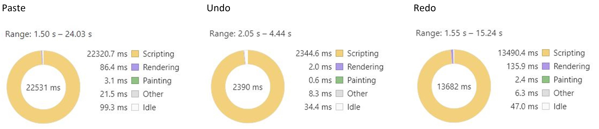
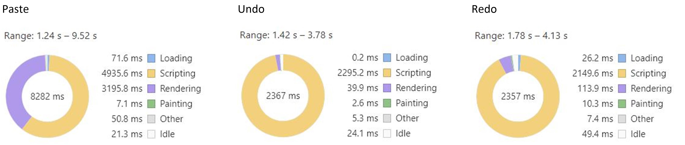
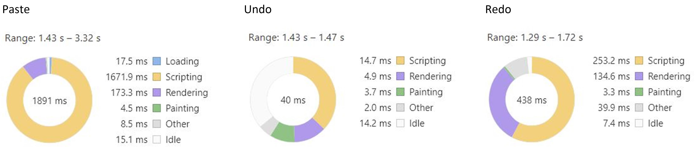
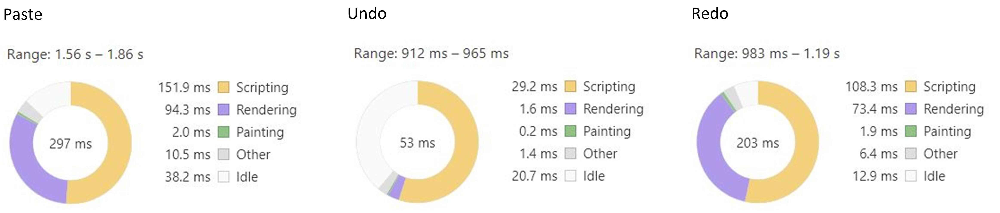

# Blank.js
Blank.js is the rich text editor for Blank Dimension. It's designed to write novels and allow authors to create their own custom formats, so its internal model must be flexible and it must be able to handle huge document efficiently.

[Demo](https://blankjs.herokuapp.com/)

## Performance
Here is the performance benchmarking with some popular rich text editors: slate.js, Google Doc, and reddit's rich text comment editor. **Google Doc has much more features than Blank.js, so the comparison here is just to see if my editor is definitely faster.**

**Scenarios:**
1. Paste huge document, undo and redo.
2. Bold huge document, undo and redo.
3. Change huge document to list, undo and redo.

**Material:** huge document (900 paragraphs) from [https://www.slatejs.org/#/huge-document](https://www.slatejs.org/#/huge-document)

### Paste huge document, undo and redo

**_slate.js_**

Paste: **22410.2 ms** = 22320.7 ms + 86.4 ms + 3.1 ms

Undo: **2347.2 ms** = 2344.6 ms + 2.0 ms + 0.6 ms

Redo: **13628.7 ms** = 13490.4 ms + 135.9 ms + 2.4 ms

**_Google Doc_**

Paste: **8138.5 ms** = 4935.6 ms + 3195.8 ms + 7.1 ms

Undo: **2337.7 ms** = 2392.2 ms + 39.9 ms + 2.6 ms

Redo: **2273.8 ms** = 2149.6 ms + 113.9 ms + 10.3 ms

**_Reddit_**

Paste: **1849.7 ms** = 1671.9 ms + 173.3 ms + 4.5 ms

Undo: **23.3 ms** = 14.7 ms + 4.9 ms + 3.7 ms

Redo: **391.1 ms** = 253.2 ms + 134.6 ms + 3.3 ms

**_Blank.js_**

Paste: **248.2 ms** = 151.9 ms + 94.3 ms + 2.0 ms

Undo: **31.0 ms** = 29.2 ms + 1.6 ms + 0.2 ms

Redo: **182.9 ms** = 108.3 ms + 73.4 ms + 1.9 ms
